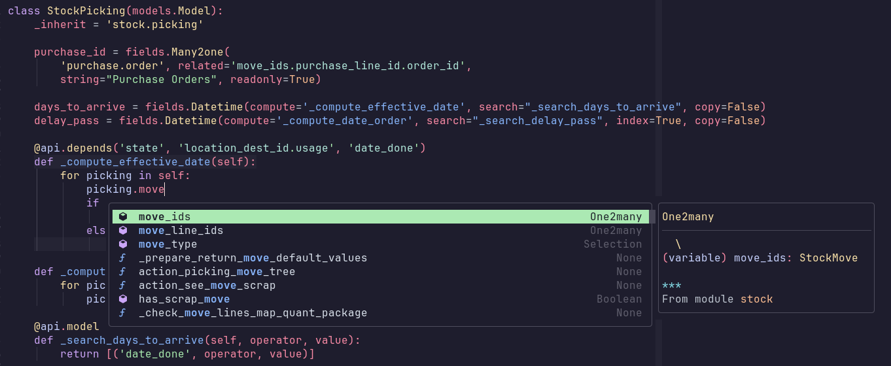
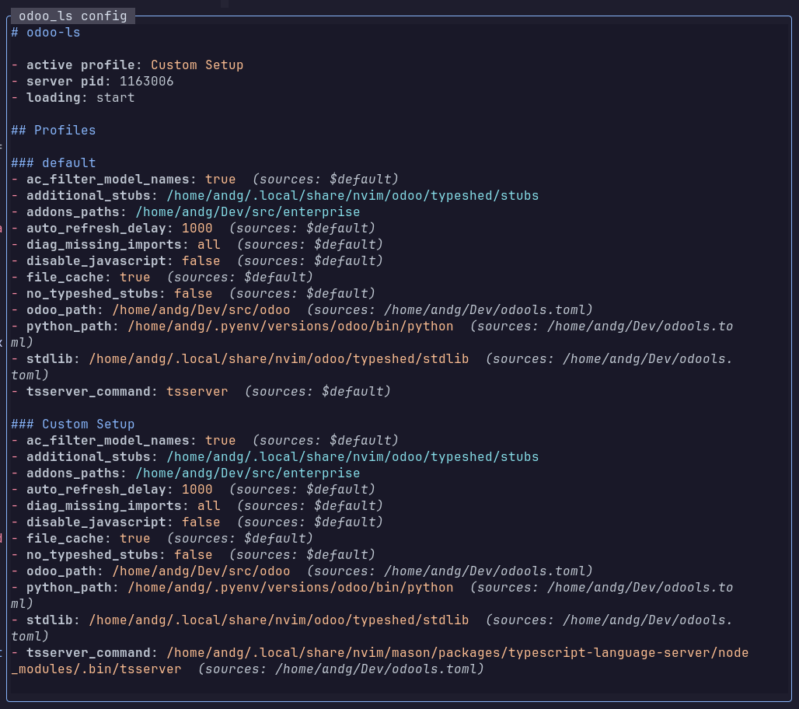
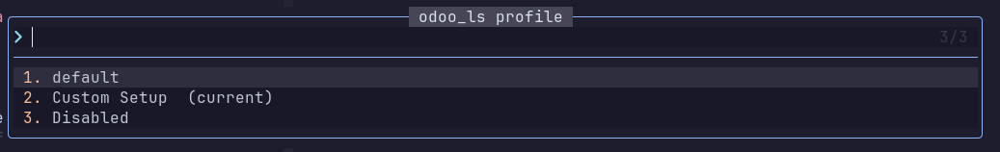
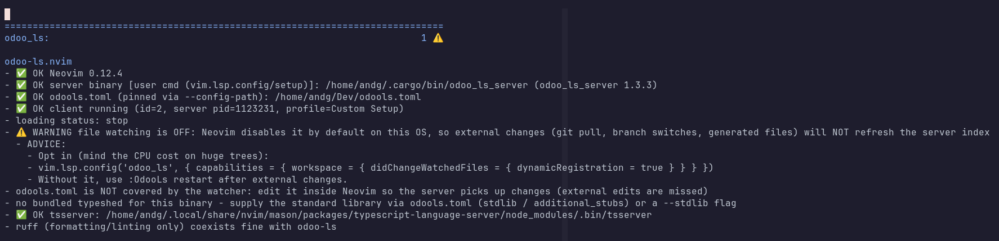

# odoo-neovim

A Neovim client for the [odoo-ls](https://github.com/odoo/odoo-ls) language
server (`odoo_ls_server`, written in Rust). It launches the binary, answers the
server's one configuration request, and handles the custom `$Odoo/*`
notification protocol. Nothing more - the server owns all real configuration.



## Design

The server discovers its configuration from an `odools.toml` file, found by
walking **up** from each workspace folder to the filesystem root. If none is
found it runs with an all-defaults `"default"` profile. This plugin does **not**
invent a parallel settings schema and imposes no keymaps or UI beyond
`vim.notify` / `vim.ui.select`. The only client-side settings are which profile
to select and how to launch the binary.

## Requirements

- Neovim **0.11.2+** (uses native `vim.lsp.config` / `vim.lsp.enable` and `lsp/`
  runtimepath discovery).
- The `odoo_ls_server` binary. Either let the plugin download a release for you
  (see [Installing the server](#installing-the-server)), put it on your `PATH`,
  or point `cmd` at it. Build it yourself with
  `cargo install --git https://github.com/odoo/odoo-ls odoo_ls_server`.

## Install

**No `setup()` call is required.** Put the plugin on runtimepath and enable the
server; the `lsp/odoo_ls.lua` spec is auto-discovered.

With [lazy.nvim](https://github.com/folke/lazy.nvim):

```lua
{
  'odoo/odoo-neovim',
  ft = { 'python', 'xml', 'csv', 'javascript' },
  config = function()
    vim.lsp.enable('odoo_ls')
  end,
}
```

Or, without a plugin manager, once the plugin dir is on runtimepath:

```lua
vim.lsp.enable('odoo_ls')
```

The server binary is resolved in this order (a `cmd` you set yourself always
wins):

1. `odoo_ls_server` on your `PATH`
2. the plugin-managed install under `vim.fn.stdpath('data') .. '/odoo'`

## Configuration

**The real configuration lives in `odools.toml`**, read by the server. See the
[odoo-ls repository](https://github.com/odoo/odoo-ls) for its schema (Python
path, extra addon paths, profiles, `tsserver_command`, etc.). `:OdooLs init`
scaffolds a starter file for you.



The client only decides two things:

- **selectedProfile** - which profile from `odools.toml` to load. The special
  value `"Disabled"` makes the server idle without loading anything. An empty
  selection maps to the server's built-in `"default"` profile.
- **cmd** - how to launch the binary.

Override them the standard Neovim way:

```lua
vim.lsp.config('odoo_ls', {
  cmd = { '/abs/path/to/odoo_ls_server' },
  settings = { Odoo = { selectedProfile = 'My Setup' } },
})
```

Or use the optional helper (equivalent, purely for convenience):

```lua
require('odoo_ls').setup({ profile = 'My Setup' })
```

> Switching profiles requires a server restart - the server re-requests its
> configuration only on init (`workspace/didChangeConfiguration` is a no-op
> server-side). `:OdooLs profile` handles the restart for you.

### odools.toml

Placed at (or above) the root of your project. `[[config]]` is an array of
tables, one per profile:

```toml
#:schema ./config_schema.json

[[config]]
name = "default"
odoo_path = "/home/user/src/odoo"
addons_paths = ["/home/user/src/enterprise"]
python_path = "/home/user/.pyenv/shims/python"
additional_stubs = ["/home/user/.local/share/nvim/odoo/typeshed/stubs"]
```

The server also accepts CLI arguments documented in
[args.rs](https://github.com/odoo/odoo-ls/blob/release/server/src/args.rs).
Notable ones: `--config-path` (pin an `odools.toml`) and `--stdlib` (stdlib
stubs path; set automatically by the plugin for a managed install).

## Commands

| Command           | Action                                                        |
| ----------------- | ------------------------------------------------------------- |
| `:OdooLs config`  | Scratch float with the active profile, all profiles, and diagnostics (default when run bare). |
| `:OdooLs profile` | Pick a profile via `vim.ui.select` and restart the server.    |
| `:OdooLs restart` | Restart the server, re-attaching current buffers.             |
| `:OdooLs logs`    | Open the newest server log file (`<exe_dir>/logs/`).          |
| `:OdooLs init`    | Scaffold a starter `odools.toml` in the cwd (best-effort auto-detection of `odoo_path`/`python_path`; adds a `#:schema` directive for [taplo](https://taplo.tamasfe.dev/) completion when a schema is available). |
| `:OdooLs install` | Download and install the server + typeshed (see [Installing the server](#installing-the-server)). |
| `:OdooLs health`  | Run `:checkhealth odoo_ls`.                                   |



## Public API

Compose these yourself:

```lua
local odoo_ls = require('odoo_ls')
odoo_ls.restart()          -- restart the server
odoo_ls.select_profile()   -- vim.ui.select + restart
odoo_ls.set_profile(name)  -- set profile and restart
odoo_ls.status()           -- table for statuslines (see below)
odoo_ls.show_config()      -- the :OdooLs config float
odoo_ls.open_logs()        -- newest log file
odoo_ls.init_config()      -- scaffold odools.toml
```

### Statusline integration

`require('odoo_ls').status()` returns a cheap snapshot:

```lua
{ running, loading, pid, profile, config_errors, config_warnings, crashed }
```

lualine example:

```lua
require('lualine').setup({
  sections = {
    lualine_x = {
      {
        function()
          local s = require('odoo_ls').status()
          if not s.running then return '' end
          if s.crashed then return 'odoo ✗' end
          if s.loading == 'start' then return 'odoo …' end
          local suffix = ''
          if s.config_errors > 0 then suffix = ' ' .. s.config_errors .. 'E' end
          if s.config_warnings > 0 then suffix = suffix .. ' ' .. s.config_warnings .. 'W' end
          return 'odoo:' .. (s.profile or '?') .. suffix
        end,
      },
    },
  },
})
```

## Health

`:checkhealth odoo_ls` reports which binary won (user `cmd`, `PATH`, or the
managed install) and its version, which `odools.toml` the server will resolve,
client status, per-buffer scope and workspace-folder coverage (see
[Known limitations](#known-limitations)), the typeshed/stdlib situation, the
real file-watching state, `tsserver` resolvability, and overlapping Python
servers.



## File watching

The server registers a `workspace/didChangeWatchedFiles` watcher so that
external changes (a `git pull`, branch switches, generated files) refresh its
index. **Neovim only honors that registration on macOS and Windows** - on
Linux/BSD, core disables the client capability by default because the available
watcher backends degrade badly on large trees
([neovim#27807](https://github.com/neovim/neovim/issues/27807)) - and an Odoo
checkout is exactly such a tree. So on Linux the index silently goes stale after
external changes; run `:OdooLs restart` after a branch switch, or opt in
knowingly:

```lua
vim.lsp.config('odoo_ls', {
  capabilities = {
    workspace = { didChangeWatchedFiles = { dynamicRegistration = true } },
  },
})
```

`:checkhealth odoo_ls` tells you which state you are in.

## Companion servers

- **lemminx** (generic XML) complements odoo-ls, which handles the
  Odoo-semantic side of the same files (xml_ids, model/field references). Run
  both. Gotcha: lemminx sends `client/unregisterCapability` with the
  correctly-spelled `unregistrations` field, while Neovim expects the LSP
  spec's misspelled `unregisterations` and errors on it; normalize per-server:

  ```lua
  vim.lsp.config('lemminx', {
    handlers = {
      ['client/unregisterCapability'] = function(err, params, ctx)
        if type(params) == 'table' and params.unregisterations == nil then
          params.unregisterations = params.unregistrations or {}
        end
        return vim.lsp.handlers['client/unregisterCapability'](err, params, ctx)
      end,
    },
  })
  ```

- **ruff** (formatting/linting only) coexists fine.
- **pyright / basedpyright** overlap with odoo-ls's Python analysis - run one
  or the other, not both. `:checkhealth odoo_ls` warns if both are attached.

## Known limitations

- **Position encoding.** This plugin advertises **utf-16 only**: all clients
  attached to a buffer must agree on the encoding, and odoo_ls shares buffers
  with utf-16-only company across its four filetypes (lemminx on XML being the
  classic case). Override via `capabilities` if you know you want utf-8.
- **Workspace folders are load-bearing.** The server fully re-analyzes
  *modified* buffers only when they live under a workspace folder; an
  uncovered buffer silently degrades on its first edit (types become `Any`,
  semantic tokens drop) even when the file is inside `odoo_path`. The default
  `root_markers` cover the checkout you are working in; if you edit several
  checkouts (e.g. odoo + enterprise) in one session, list them explicitly via
  `workspace_folders` in `vim.lsp.config('odoo_ls', ...)`. `:checkhealth
  odoo_ls` flags uncovered buffers.
- **`odools.toml` is not watched.** The server only notices edits made inside
  Neovim (via didOpen/didChange/didSave). External edits are missed - restart
  the server to pick them up.
- **`workspace/fileOperations`** (didCreate/didRename/didDelete) are advertised
  by the server but Neovim core does not emit them. File-explorer integrations
  (oil.nvim, etc.) may; out of scope here.

## License

LGPL-3.0, the same as the language server.
